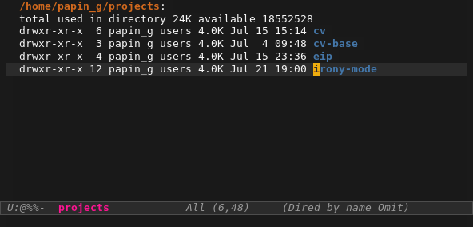

# Irony-Mode

## A C/C++ minor mode powered by [libclang][libclang-ref]

`irony-mode` is an Emacs minor-mode that aims at improving the editing
experience for the C, C++ and Objective-C languages. It works by using a
combination of an Emacs package and a C++ program (`irony-server`) that uses
[libclang][libclang-ref].

**Features:**

* Code completion:
  * With Emacs' built-in `completion-at-point-functions`
  * With [company-mode][company-ref]'s backend: [company-irony][company-irony-ref]
  * With [auto-complete][ac-ref]' source: [ac-irony][ac-irony-ref]

## Dependencies

### Elisp dependencies

These dependencies will be installed automatically when using the
[standard installation](#installation) procedure described below.

| Package               | Comment                                                                                  |
| --------------------- | ---------------------------------------------------------------------------------------- |
| [cl-lib][cl-lib-ref]  | Built-in since Emacs 24.3                                                                |
| [YASnippet][yas-ref]  | Optional. Used only when available to provide snippets expansion of completion arguments |

### Irony-Server prerequisites

`irony-server` provides the [libclang][libclang-ref] interface to `irony-mode`.
It uses a simple protocol based on S-expression. This server, written in C++ and
requires the following packages to be installed on your system:

* [CMake][cmake-ref] >= 2.8.3
* [libclang][libclang-ref]

## Installation

The recommended way to install `irony-mode` and its dependencies is to use a
package manager.

* Using [MELPA](http://melpa.milkbox.net/)

        M-x package-install RET irony-mode RET

* Using [el-get](https://github.com/dimitri/el-get)

        M-x el-get-install RET irony-mode RET

## Configuration

~~~el
(add-hook 'c++-mode-hook 'irony-mode)
(add-hook 'c-mode-hook 'irony-mode)
(add-hook 'objc-mode-hook 'irony-mode)

;; replace the `completion-at-point' and `complete-symbol' bindings in
;; irony-mode's buffers by irony-mode's function
(defun my-irony-mode-hook ()
  (define-key irony-mode-map [remap completion-at-point]
    'irony-completion-at-point-async)
  (define-key irony-mode-map [remap complete-symbol]
    'irony-completion-at-point-async))
(add-hook 'irony-mode-hook 'my-irony-mode-hook)
~~~

## Usage

On the first run, `irony-mode` will ask you to build and install `irony-server`.
To do so, type `M-x irony-install-server RET`.

To tune `irony-mode`, use `customize`:

    M-x customize-group RET irony RET

In order to provide context sensitive and accurate information, `irony-mode`
needs to know about the compiler flags used to parse the current buffer. The
best way to achieve this is to use a
[Compilation Database](#compilation-database).

## Compilation Database

In order to work correctly, `irony-mode` needs to know the compile flags.
`irony-cdb` aims to provide *as automatic as possible* compile flags discovery,
with minimal user input.

Type `M-x irony-cdb-menu RET` to display the build configuration menu.

The menu should be self explanatory, it will let you chose amongst a list of
*compilation databases*. It works great with the following ones:

- [.clang_complete][clang_complete-doc-ref] - A file at the root of your project
  containing the compilation flags, one per line. This is compatible with the
  with plugin [Rip-Rip/clang_complete][clang_complete-vim-ref]. If you want to
  generate the `.clang_complete` automatically, take a look there:
  [cc_args.py documentation][cc_args-py-doc-ref].

<!---

- [CMake][cmake-ref] >= 2.8.5

- [Ninja][ninja-ref] >= 1.2 - Use `ninja -t compdb` to generate a compilation
  database for your project.

- [Bear][bear-ref] - Bear is a tool that can generate a
  `compile_commands.json` file by "monitoring" the build of a project.
  The typical usage for a `make` based project will be `bear -- make -B`.

The [JSON Compilation Database Format Specification][clang-compile-db-ref] page
may reference some new tools in the future that supports the
`compile_commands.json` format. `irony-mode` support that file format and
hopefully it should work *out-of-the-box* for any of such tools.
-->

## FAQ

__It's slow, why?__

A bug in old version of Clang (at least '3.1-8') caused the completion to fail
on the standard library types. To eliminate this bug an optimisation has been
disabled in the parsing of a translation unit. This result in a slower parsing.

This only affect old versions of Clang (< 3.2), it is suggested to update your
libclang installation if you want to take advantage of the optimizations.

__libclang.so: cannot open shared object file...__

Compiling `irony-server` succeed but you have the following message when you try
to run the `irony-server` executable:

    'irony-server: error while loading shared libraries: libclang.so: cannot open shared object file: No such file or directory

When `libclang` is installed in a non-standard location (one that is missing
from the path list of the dynamic loader, see *ld.so.conf*) you can tell CMake
to use the [rpath][rpath-ref] when installing the target `irony-server`. To
enable rpath in CMake use the following command:

    cmake -DCMAKE_INSTALL_RPATH_USE_LINK_PATH=ON <args...>

[ac-irony-ref]: https://github.com/Sarcasm/ac-irony "AC Irony"
[ac-ref]: https://github.com/auto-complete/auto-complete "Auto Complete"
[bear-ref]: https://github.com/rizsotto/Bear "Bear"
[cc_args-py-doc-ref]: https://github.com/Rip-Rip/clang_complete/blob/c8673142759b87316265eb0edd1f620196ec1fba/doc/clang_complete.txt#L270 "cc_args.py documentation"
[cl-lib-ref]: http://elpa.gnu.org/packages/cl-lib.html "cl-lib"
[clang-compile-db-ref]: http://clang.llvm.org/docs/JSONCompilationDatabase.html "Clang: JSONCompilationDatabase"
[clang_complete-doc-ref]: https://github.com/Rip-Rip/clang_complete/blob/c8673142759b87316265eb0edd1f620196ec1fba/doc/clang_complete.txt#L55 ".clang_complete"
[clang_complete-vim-ref]: https://github.com/Rip-Rip/clang_complete "clang_complete Vim plugin"
[cmake-ref]: http://www.cmake.org "CMake"
[company-irony-ref]: https://github.com/Sarcasm/company-irony "Company Irony"
[company-ref]: https://github.com/company-mode/company-mode "Company-Mode"
[libclang-ref]: http://clang.llvm.org/doxygen/group__CINDEX.html "libclang: C Interface to Clang"
[ninja-ref]: http://martine.github.io/ninja/ "Ninja"
[rpath-ref]: http://en.wikipedia.org/wiki/Rpath "rpath Wikipedia article"
[yas-ref]: https://github.com/capitaomorte/yasnippet "YASnippet"
